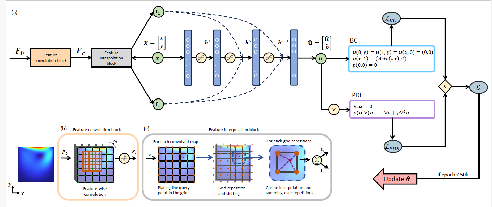

# Parametric Grid Convolutional Attention Networks (PGCAN)

PGCAN introduces a novel architecture for solving Partial Differential Equations (PDEs) by combining parametric grid-based encoding with convolutional and attention mechanisms to address spectral bias and enhance solution accuracy for complex PDEs.

## Overview

PGCAN leverages Parametric Grid Encoding, Convolutional Layers, and an Attention Mechanism to improve the learning of PDE solutions. This approach structures the input space, reduces overfitting, enhances feature capture, and prioritizes significant features for accurate and efficient PDE solution approximation.


_Figure 1: PGCAN architecture._


_Figure 2: Comparative results._


## Quick Start

## 1. Installation

### Clone PIXEL repo

```
git clone 
cd pgcan
```

### Create environment

The code is tested with Python 3.8.8 PyTorch 1.13.1 with CUDA 11.6. 
You can create an anaconda environment with those requirements by running:

```
conda env create -f environment.yml
```
```
conda activate pgcan
```


## Usage

To run PGCAN, follow these steps:

## 2. Run
You can run pgcan and other models directly using the following code.
[NS cavity equation]
```
python benchmark.py
```


## Citation

@article{pgcan2024,
  title={Parametric Encoding with Attention and Convolution Mitigate Spectral Bias of Neural Partial Differential Equation Solvers},
  author={Author Names},
  journal={Journal Name},
  year={2024}
}


## Contact

For queries, please contact Raminb@uci.edu.


