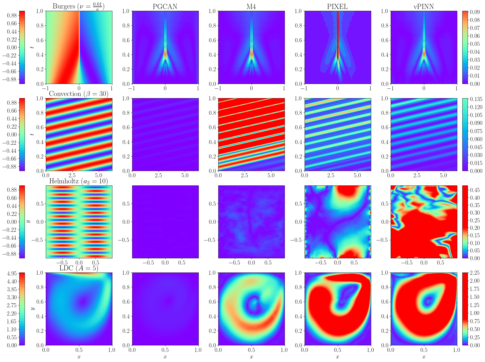

# Parametric Grid Convolutional Attention Networks (PGCAN)

PGCAN introduces a novel architecture for solving Partial Differential Equations (PDEs) by combining parametric grid-based encoding with convolutional and attention mechanisms to address spectral bias and enhance solution accuracy for complex PDEs.

## Overview

PGCAN leverages Parametric Grid Encoding, Convolutional Layers, and an Attention Mechanism to improve the learning of PDE solutions. This approach structures the input space, reduces overfitting, enhances feature capture, and prioritizes significant features for accurate and efficient PDE solution approximation.


_Figure 1: PGCAN architecture._


_Figure 2: Comparative results._


## Installation

To use PGCAN, ensure you have Python and the following packages installed:


## Usage

To run PGCAN, follow these steps:

1. Define the PDE system and boundary conditions.
2. Initialize the PGCAN model.
3. Train the model using the provided training script.

```python
from pgcan import PGCANModel

# Define your PDE system and conditions here

model = PGCANModel(settings)
model.train()


